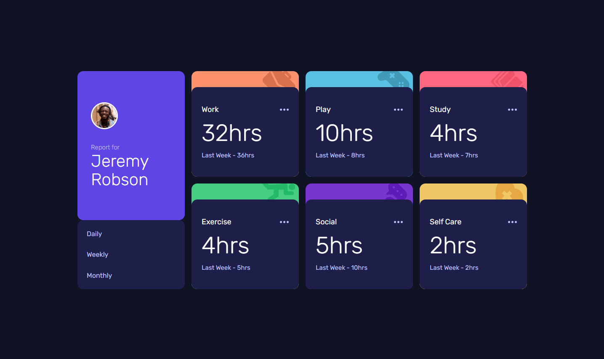

# 📊 Time Tracking Dashboard

A responsive time tracking dashboard that displays daily, weekly, and monthly activity statistics. Built with **HTML, CSS, and JavaScript**, it dynamically fetches data from a local JSON file.

---

## 🚀 Features

- **Dynamic Data Fetching**: Uses JavaScript's `fetch()` to load data from a `data.json` file.
- **Timeframe Toggle**: Users can switch between **Daily**, **Weekly**, and **Monthly** stats.
- **Responsive Design**: Optimized for both mobile and desktop devices.
- **Minimalist UI**: Clean and modern design with subtle hover effects.

---

## 📝 Live Demo

[View the live site here](https://jayco01.github.io/time-tracking-dashboard/)

---

## 📝 Screenshot




---

## ⚙️ How It Works

1. **Data Fetching**
- The project fetches data from `data.json` using JavaScript's `fetch()` API.
- Example code:

```javascript
fetch('data.json')
  .then(response => response.json())
  .then(data => populateDOM(data));
```

2. **Timeframe Switching**
- Users can click on **Daily**, **Weekly**, or **Monthly** buttons.
- The data dynamically updates based on the selected timeframe.

3. **Updating the DOM**
- The data for each activity (like Work, Play, Study) is displayed in separate cards.
- The UI updates in real-time as per the selected timeframe.

---

## 🧹 JSON Data Structure

```json
[
  {
    "title": "Work",
    "timeframes": {
      "daily": { "current": 5, "previous": 7 },
      "weekly": { "current": 32, "previous": 36 },
      "monthly": { "current": 103, "previous": 128 }
    }
  },
  ...
]
```

- **`title`**: The activity title (e.g., Work, Play).  
- **`timeframes`**: Contains the current and previous stats for each timeframe.

---

## 📚 Key Concepts Used
- **JavaScript's `fetch()` API** for data fetching.
- **DOM Manipulation** to update UI based on JSON data.
- **Responsive Design** using media queries.
- **CSS Grid & Flexbox** for flexible layouts.

---

## 🐞 Troubleshooting
- Ensure the project is running on a **local server**; otherwise, `fetch()` won't work due to CORS restrictions.
- If the data isn't displaying, check the browser console for errors using `Ctrl + Shift + I` (Windows/Linux) or `Cmd + Option + I` (Mac).

---


## ✨ Acknowledgments
- [Frontend Mentor](https://www.frontendmentor.io/) for providing the challenge inspiration.
- [MDN Web Docs](https://developer.mozilla.org/) for JavaScript and CSS references.

---

Happy Coding! 🚀

